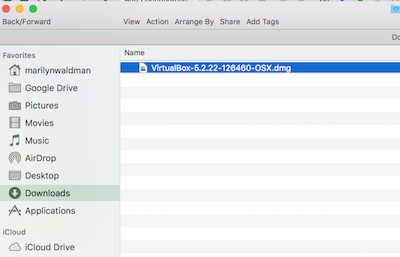

# VirtualBox + Vagrant Installation
> Install VirtualBox and Vagrant on MAC OS

## Download and Install VirtualBox
### Open a browser window and go to:  [Download VirtualBox](https://www.virtualbox.org/wiki/Downloads) 

  - Download VirtualBox
  
       
      
  - Go to you Downloads directory from Finder
    
             
  
  - Drag to Apps 
  
  - Double click and Run
  
        
  
  - Installation
    
        
  
  - Installation Type
      
        
    
  - Enter your password
        
        
       
  - Click move to trash
          
                
  
 
## Download and Install Vagrant
### Open a browser window and go to:  [Download Vagrant](https://www.vagrantup.com/downloads.html) 

- Download VirtualBox
  
      
      
  - Go to you Downloads directory from Finder
    
           
  
  - Drag to Apps 
  
  - Double click and Run
  
        
  
  - Installation
    
        
  
  - Installation Type
      
        
    
  - Enter your password
        
        
       
  - Click success and move to trash
          
                
  
