# VirtualBox - Vagrant Setup
> Start vagrant and install guest additions

  - There are issues with Virtual Box especially with copy/paste
  - We will start our virtual machine then install guest additions so you can
    copy and paste.
    
 
###  NOTICE 
#### COPY will be (SHIFT CONTROL C)
#### PASTE will be (SHIFT CONTROL VZ)

## VAGRANT

  - Open a terminal 
  
      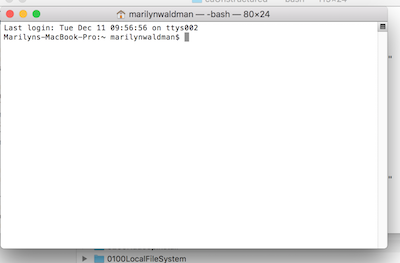 
      
  - Make sure you are in your $HOME directory and clone vagrant
  
```bash
    cd
    git clone https://github.com/marilynwaldman/vagrant.git
```  
   
   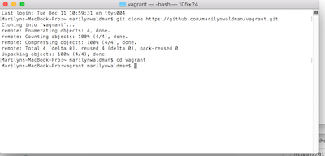      
  
  - Change directory to vagrant
  ```bash
    cd vagrant
    pwd
  ```
  
  - run vagrant up - this will run for a long time.  Wait until you get a 
  command line
  ```bash
    vagrant up
  ```
  
   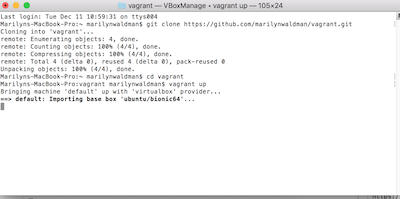 
  
  - You will see a terminal like this
    
   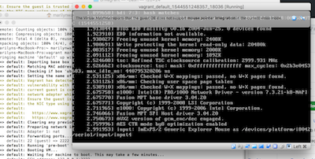 
    
  - Go to APPS and double click on VirtualBox
        
   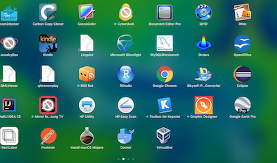 
       
  - Shut the VM down
          
   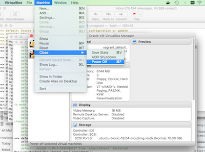 
   
   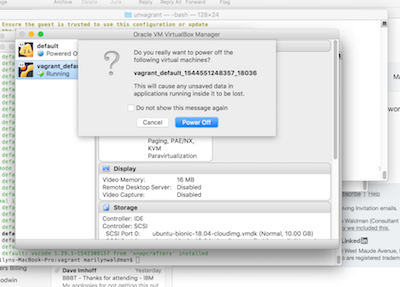 
   
            
  
### Install Guest Additions

  - Add an optical drive
  
  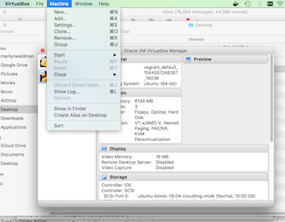 
  
  - Add an optical drive
    
   
  
  - Go to Settings
      
  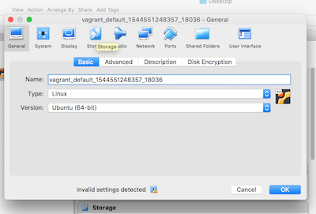 
      
  - Add the optical drive
        
   
  
  - Select "Empty"
          
  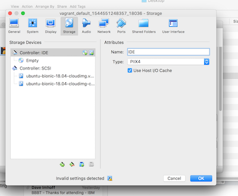 
  
  - Restart VM
           
  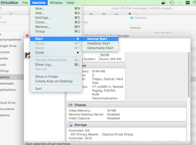 
   
  - Go to Devices and Add Guest Additions
              
  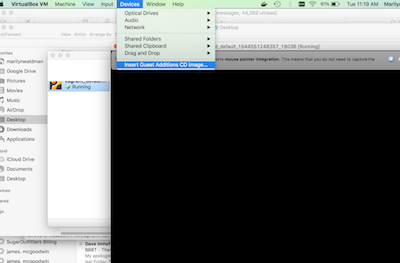  
  
  - Shut the vm down
                
   
     
   
  
### Recycle vagrant  
  
  - go to your terminal and stop vagrant
  
```bash
    vagrant halt
```  
  - vagrant up
  
 ```bash
   vagrant up
 ```    
 
### Your vm will be restarted

   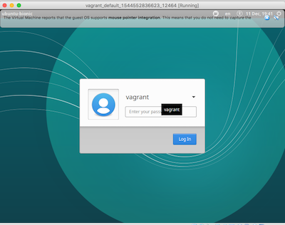 
   
   - Password is 'vagrant'
   
   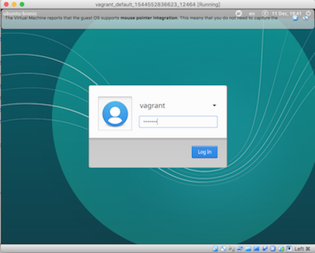
   
   
   - Remove message at top my clicking on the little 'x' on the top right hand side
      
   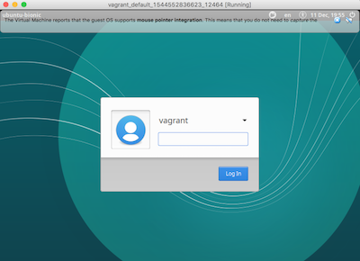   
   
   - This is your user interface
   
   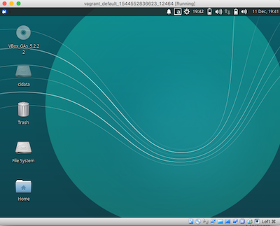   
   
   - Click the little fish on the upper left hand side
      
     
   
   - Click the little fish on the upper left hand side
         
   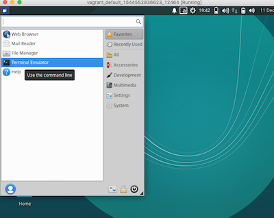 
   
   - This is your terminal
            
   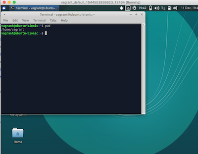 
   
   - Click the red button on the upper left hand side to shut your VM off
   
   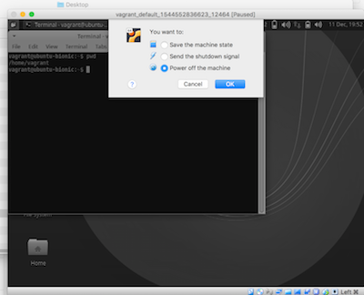  
   
   - Shut Vagrant down
```bash
   vagrant halt
```   

````aidl
Marilyns-MacBook-Pro:vagrant marilynwaldman$ vagrant halt
==> default: Attempting graceful shutdown of VM...
Marilyns-MacBook-Pro:vagrant marilynwaldman$ 

````
   
      
     
   
   


              
    
     