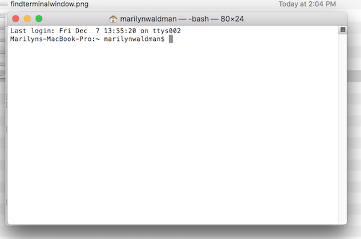
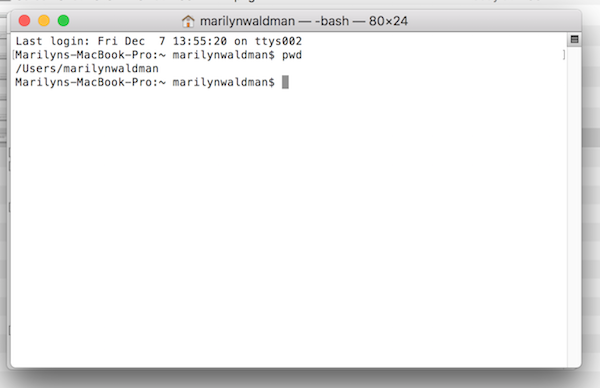

##  MAC OS FILE SYSTEM COMMANDS

* pwd   - Present Working Directory
* mkdir - Make Directory
* cd    - Change Directory
* \>\>    - Append to a file (redirect output)
* ls    - List the contents of a file
* cat   - List the contents of a file
* cp    - Copy a file
* mv    - Rename or move a file
* rm    - Remove a file or a directory

## Exercies

1. Find the TERMINAL icon on the bottom toolbar.

 

2. Open a terminal

 

3. Copy and paste the following commands

  ```bash
  pwd
  ```

    

4. Copy and paste the following commands

  ```bash
  mkdir mydir
  ```
5. Copy and paste the following commands

  ```bash
  cd mydir
  ```
5. Copy and paste the following commands

  ```bash
  pwd
  ls
  ls -l
  ```


6. Append some lines to an empty file 

  ```bash
  echo "The quick brown fox " >> myfile
  ```
  ```bash
  cat myfile
  ```


7. Append two more lines

  ```bash
  echo "jumped over  " >> myfile
  ```
  ```bash
  echo "the lazy dog's back." >> myfile
  ```
  ```bash
  cat myfile
  ```


7. Copy myfile to myfile_copy

  ```bash
  cp myfile myfile_copy
  ```
  ```bash
  ls -l
  ```
  ```bash
  cat myfile_copy_
  ```


 


