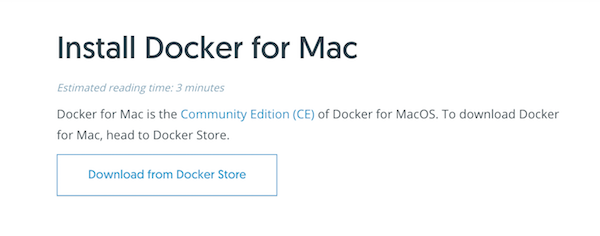
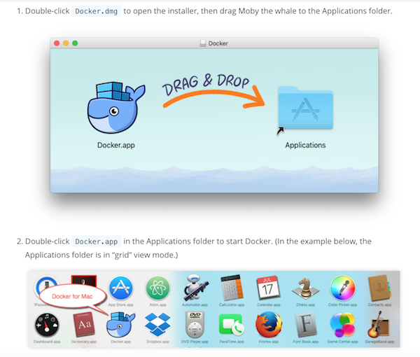
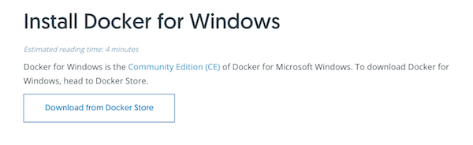
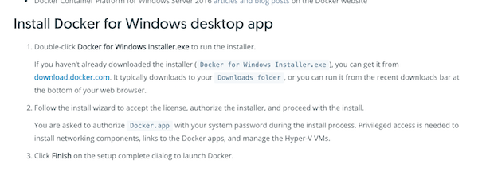
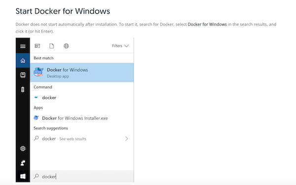
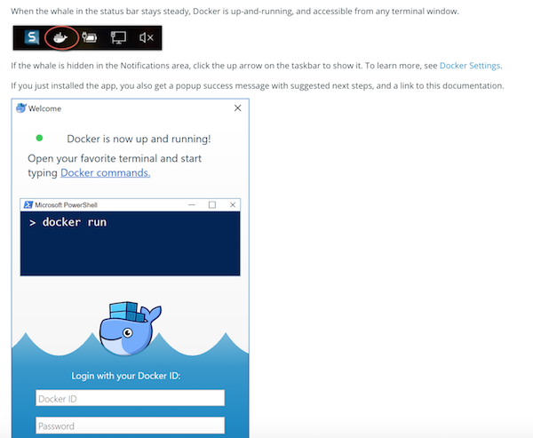

# Docker Installation
> Install Docker on your machine


## Download and Install
### OS X & Linux:

[MAC Installation Instructions](https://docs.docker.com/docker-for-mac/install/) a

  - Download docker
  
   
  
  - Drag to Apps 
  
  - Double click and Run
  
   
  
  - Open a terminal window and type
  
```bash
  $docker ps
```    

You should see:

````
Marilyns-MacBook-Pro:~ marilynwaldman$ docker ps
CONTAINER ID        IMAGE               COMMAND             CREATED             STATUS              PORTS               NAMES
Marilyns-MacBook-Pro:~ marilynwaldman$ 
 
````
    
### Windows:

[Windows Installation Instructions](https://docs.docker.com/docker-for-windows/install/)

  - Download executable
   
  
  - Run the .exe file
   
  
  - Start Docker
     
    
  - Open a terminal and type 'ps'
         


