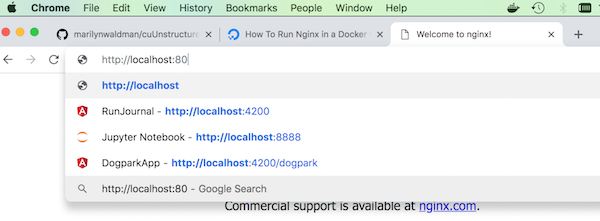
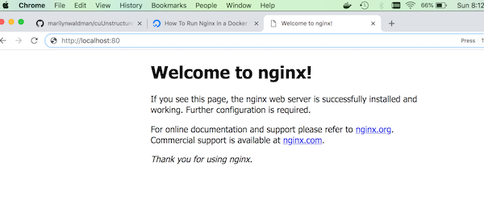

# Docker Tutorial:  Nginx

   - docker run
   - docker images
   - docker ps, docker ps -a
   - docker stop, start
   - docker cmd-line
   
   
   [Digital Ocean Tutorial](https://www.digitalocean.com/community/tutorials/how-to-run-nginx-in-a-docker-container-on-ubuntu-14-04)

## Docker Ngix concepts
 

## First see what containers are currently running
```bash
   docker ps
```
I have no running containers
````
Marilyns-MacBook-Pro:~ marilynwaldman$ docker ps
CONTAINER ID        IMAGE               COMMAND             CREATED             STATUS              PORTS               NAMES
Marilyns-MacBook-Pro:~ marilynwaldman$ 
````

## Check the status of your containters

```bash
   docker ps -a
```

````
Marilyns-MacBook-Pro:~ marilynwaldman$  docker ps -a
CONTAINER ID        IMAGE               COMMAND             CREATED             STATUS              PORTS               NAMES
Marilyns-MacBook-Pro:~ marilynwaldman$ 
Marilyns-MacBook-Pro:~ marilynwaldman$ 
````
    
## Pull the Nginx Containter
```bash
   docker pull nginx
```

```aidl
Marilyns-MacBook-Pro:~ marilynwaldman$ docker pull nginx
Using default tag: latest
latest: Pulling from library/nginx
a5a6f2f73cd8: Pull complete 
1ba02017c4b2: Pull complete 
33b176c904de: Pull complete 
Digest: sha256:5d32f60db294b5deb55d078cd4feb410ad88e6fe77500c87d3970eca97f54dba
Status: Downloaded newer image for nginx:latest
Marilyns-MacBook-Pro:~ marilynwaldman$ 
```
## Expose a port and run the web server
Any time you connect to a web service you must specify a port.

```bash
  docker run --name docker-nginx -p 80:80 nginx
```
   - run creates a new containter
   - name will specify the name we apply to the container
   - p specifies the port we will connect to
   - nginx is the name of the image we are pulling from Dockerhub, an online
   library of available images.
   
   Your container will run until you type "CNTL-C" in the terminal window
   
   Issue the following in your browser
   
   


````aidl

http://localhost:80

````

 

You should see this:

 

## List the hello-world image that was downloaded to your machine:

```bash
   docker images ls
```

````aidl
Marilyns-MacBook-Pro:~ marilynwaldman$ docker images
REPOSITORY          TAG                 IMAGE ID            CREATED             SIZE
hello-world         latest              4ab4c602aa5e        3 months ago        1.84kB
Marilyns-MacBook-Pro:~ marilynwaldman$ 

````

## Find all running containers on your machine.
Notice that hello world is not running.  It started, printed 'hello world', then
stopped.

```bash
  docker ps
```

````aidl
Marilyns-MacBook-Pro:~ marilynwaldman$ docker ps
CONTAINER ID        IMAGE               COMMAND             CREATED             STATUS              PORTS               NAMES
Marilyns-MacBook-Pro:~ marilynwaldman$ 

````

Enter (CNTL-C) in your terminal window to stop the server

## Check the status of your containers

```bash
   docker ps -a

```

````aidl
    CONTAINER ID        IMAGE               COMMAND                  CREATED             STATUS                      PORTS               NAMES
    0796c816a39c        nginx               "nginx -g 'daemon of…"   12 minutes ago      Exited (0) 17 seconds ago                       docker-nginx

````

Notice the 'status' is 'exited'.  This means the contain.er ran and has terminated.
The system also gave the container the funny name 'quirky_gagarin.' We will learn
to give meaningful names in a later lesson.

## Remove this container

```bash
   docker rm docker-nginx
   docker ps -a
```

````aidl
Marilyns-MacBook-Pro:~ marilynwaldman$  docker rm docker-nginx
docker-nginx
Marilyns-MacBook-Pro:~ marilynwaldman$ docker ps -a
CONTAINER ID        IMAGE               COMMAND             CREATED             STATUS              PORTS               NAMES
Marilyns-MacBook-Pro:~ marilynwaldman$ 
````

## Restart Nginx in the background
```bash
  docker run --name docker-nginx -p 80:80 -d nginx
```

````aidl
Marilyns-MacBook-Pro:~ marilynwaldman$ docker run --name docker-nginx -p 80:80 -d nginx
a540d93ae31b0b51893a8dd1511920f8e1bf7d7615321850f057b42932fbb314
````

## Check the status of the RUNNING containers:

```bash
   docker ps 
```

````aidl
Marilyns-MacBook-Pro:~ marilynwaldman$ docker ps 
CONTAINER ID        IMAGE               COMMAND                  CREATED              STATUS              PORTS                NAMES
a540d93ae31b        nginx               "nginx -g 'daemon of…"   About a minute ago   Up About a minute   0.0.0.0:80->80/tcp   docker-nginx
````

## Stop Nginx and check that it terminated

```bash
   docker stop docker-nginx
   docker ps
```

```
Marilyns-MacBook-Pro:~ marilynwaldman$  docker stop docker-nginx
docker-nginx
Marilyns-MacBook-Pro:~ marilynwaldman$ docker ps
CONTAINER ID        IMAGE               COMMAND             CREATED             STATUS              PORTS               NAMES
Marilyns-MacBook-Pro:~ marilynwaldman$ 

```

### Cleanup

   - Remove containers one at a time
   
```bash
  docker ps -a
  docker rm docker-nginx
  docker ps -a
  
```   

```aidl
Marilyns-MacBook-Pro:~ marilynwaldman$ docker ps -a
CONTAINER ID        IMAGE               COMMAND                  CREATED             STATUS                          PORTS               NAMES
a540d93ae31b        nginx               "nginx -g 'daemon of…"   5 minutes ago       Exited (0) About a minute ago                       docker-nginx
Marilyns-MacBook-Pro:~ marilynwaldman$  docker rm docker-nginx
docker-nginx
Marilyns-MacBook-Pro:~ marilynwaldman$ docker ps -a
CONTAINER ID        IMAGE               COMMAND             CREATED             STATUS              PORTS               NAMES
Marilyns-MacBook-Pro:~ marilynwaldman$ 
```

