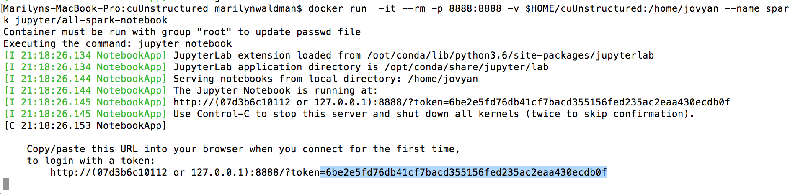
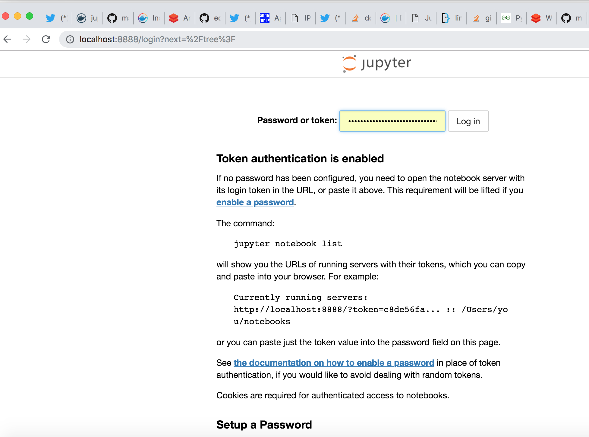
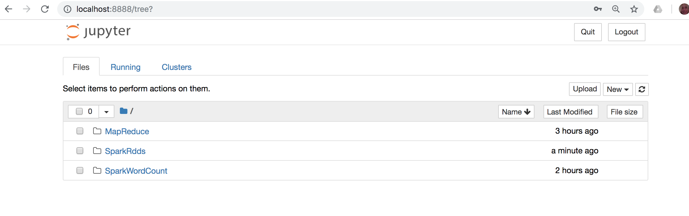

### Install Spark


####  Prerequites

   - Docker
   - Git
   
#### 1.  Go to your $HOME directory and get class notebooks  
   
````
    $ cd
    $ rm -rf cuUnstructured
    $ git clone  https://github.com/marilynwaldman/unstructuredNotebooks.git && rm -rf /unstructuredNotebooks.git

````


#### 2.  From the terminal window pull the spark image. 
        This takes a long time to download so please run this before coming to class.

````
    $ docker pull  jupyter/all-spark-notebook

```` 


####  3.  From the terminal window run the image and start Jupyter.  Make sure you are in your $Home directory. 

````
    $ cd
    $ docker run  -it --rm -p 8888:8888 -v $HOME/unstructuredNotebooks/work:/home/jovyan --name spark jupyter/all-spark-notebook

```` 
##### It should look like this.  Copy (CNTL-C ) the token




####  4.  Go to localhost:8888

 

####  5.  Paste your token into the box

 

####  6.  Jupyter notebooks should appear.

 


