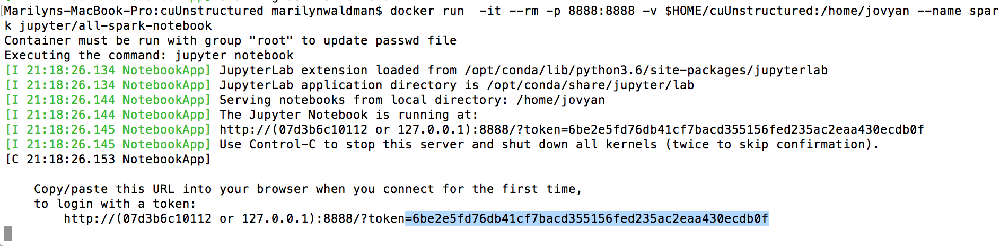
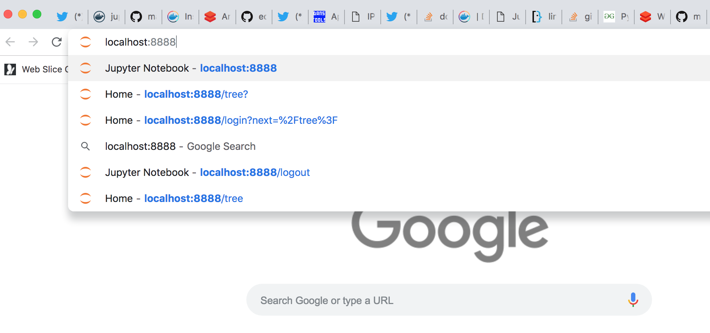
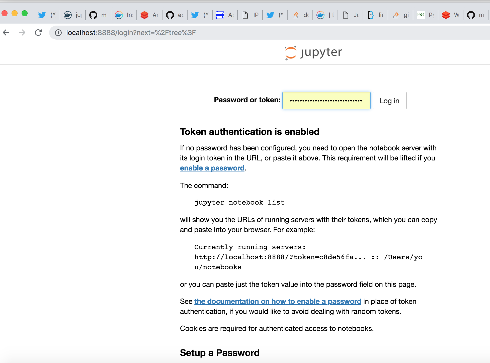
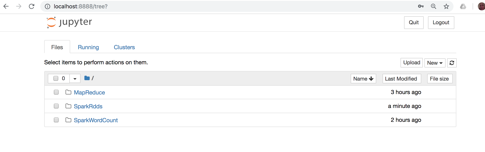

##  Install Github and git
##  Install Docker
##  From your home directory get this repo


````
    $ cd
    $ rm -rf cuUnstructured
    $ git clone  https://github.com/marilynwaldman/cuUnstructured.git && rm -rf cuUnstructured/.git

````


##  pull the spark image and start a Spark Notebook - this takes a long time to download

````
    docker pull  jupyter/all-spark-notebook

```` 


##  run the  image and start a Spark Notebook - this takes a long time to download

````
    docker run  -it --rm -p 8888:8888 -v $HOME/cuUnstructured:/home/jovyan --name spark jupyter/all-spark-notebook

```` 
#### it should look like this - copy (CNTL-C ) the token




##  go to localhost:8888

 

##  paste your token

 

##  you should see jupyter notebooks

 


